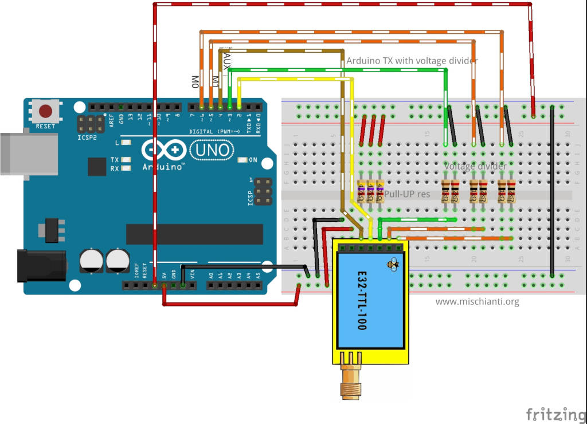
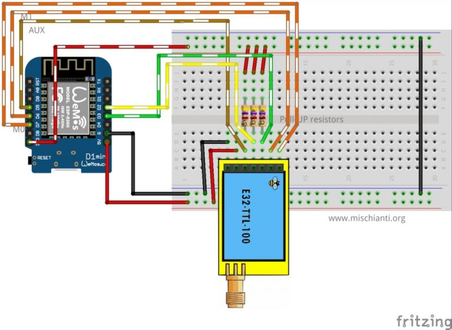
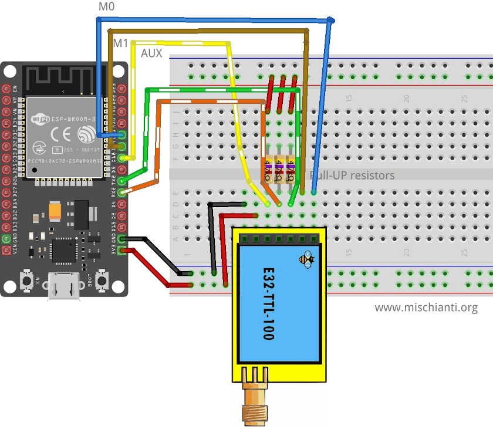

## Wiring

### Arduino wiring



## Arduino program (no library)

```c++
*
 * LoRa E32-TTL-100
 * Start device or reset to send a message
 * https://mischianti.org
 *
 * E32-TTL-100----- Arduino UNO
 * M0         ----- GND
 * M1         ----- GND
 * TX         ----- PIN 2 (PullUP)
 * RX         ----- PIN 3 (PullUP & Voltage divider)
 * AUX        ----- Not connected
 * VCC        ----- 3.3v/5v
 * GND        ----- GND
 *
 */
#include "Arduino.h"
 
#include <SoftwareSerial.h>
 
SoftwareSerial mySerial(2, 3); // e32 TX e32 RX
 
void setup() {
  Serial.begin(9600);
  delay(500);
 
  Serial.println("Hi, I'm going to send message!");
 
  mySerial.begin(9600);
  mySerial.println("Hello, world?");
}
 
void loop() {
  if (mySerial.available()) {
    Serial.write(mySerial.read());
  }
  if (Serial.available()) {
    mySerial.write(Serial.read());
  }
}
```


### Arduino Program (with library)

```c++
/*
 * LoRa E32-TTL-100
 * Write on serial to transfer a message to other device
 * https://mischianti.org
 *
 * E32-TTL-100----- Arduino UNO
 * M0         ----- GND
 * M1         ----- GND
 * TX         ----- PIN 2 (PullUP)
 * RX         ----- PIN 3 (PullUP & Voltage divider)
 * AUX        ----- Not connected
 * VCC        ----- 3.3v/5v
 * GND        ----- GND
 *
 */
#include "Arduino.h"
#include "LoRa_E32.h"
 
LoRa_E32 e32ttl100(2, 3); // e32 TX e32 RX
 
void setup() {
  Serial.begin(9600);
  delay(500);
 
  Serial.println("Hi, I'm going to send message!");
 
  // Startup all pins and UART
  e32ttl100.begin();
 
  // Send message
  ResponseStatus rs = e32ttl100.sendMessage("Hello, world?");
  // Check If there is some problem of successfully send
  Serial.println(rs.getResponseDescription());
}
 
void loop() {
    // If something available
  if (e32ttl100.available()>1) {
      // read the String message
    ResponseContainer rc = e32ttl100.receiveMessage();
    // Is something goes wrong print error
    if (rc.status.code!=1){
        rc.status.getResponseDescription();
    }else{
        // Print the data received
        Serial.println(rc.data);
    }
  }
  if (Serial.available()) {
      String input = Serial.readString();
      e32ttl100.sendMessage(input);
  }
}
```


### ESP8266 Wiring




koneksi antara Lora E32 ke ESP8266

| Pin/Signal | Connection/Description |
| ---------- | ---------------------- |
| M0         | GND (Set normal mode)  |
| M1         | GND (Set normal mode)  |
| RX         | PIN D2 (PullUP 4,7KΩ)  |
| TX         | PIN D3 (PullUP 4,7KΩ)  |
| AUX        | Not connected          |
| VCC        | 3.3v                   |
| GND        | GND                    |

### Wemos D1 mini ESP8266 code program (No Library)

```c++
*
 * LoRa E32-TTL-100
 * Start device or reset to send a message
 * https://mischianti.org
 *
 * E32-TTL-100----- Wemos D1 mini
 * M0         ----- GND
 * M1         ----- GND
 * TX         ----- PIN D2 (PullUP)
 * RX         ----- PIN D3 (PullUP)
 * AUX        ----- Not connected
 * VCC        ----- 3.3v/5v
 * GND        ----- GND
 *
 */
#include "Arduino.h"
#include <SoftwareSerial.h>
 
SoftwareSerial mySerial(D2, D3); // e32 TX e32 RX
 
void setup() {
  Serial.begin(9600);
  delay(500);
 
  Serial.println("Hi, I'm going to send message!");
 
  mySerial.begin(9600);
  mySerial.println("Hello, world?");
}
 
void loop() {
  if (mySerial.available()) {
    Serial.write(mySerial.read());
  }
  if (Serial.available()) {
    mySerial.write(Serial.read());
  }
}
```

ESP8266 with library 

```c++
/*
 * LoRa E32-TTL-100
 * Start device or reset to send a message
 * https://mischianti.org
 *
 * E32-TTL-100----- Wemos D1 mini
 * M0         ----- GND
 * M1         ----- GND
 * TX         ----- PIN D2 (PullUP)
 * RX         ----- PIN D3 (PullUP)
 * AUX        ----- Not connected
 * VCC        ----- 3.3v/5v
 * GND        ----- GND
 *
 */
#include "Arduino.h"
#include "LoRa_E32.h"
 
LoRa_E32 e32ttl100(D2, D3); // e32 TX e32 RX
 
void setup() {
  Serial.begin(9600);
  delay(500);
 
  Serial.println("Hi, I'm going to send message!");
 
  // Startup all pins and UART
  e32ttl100.begin();
 
  // Send message
  ResponseStatus rs = e32ttl100.sendMessage("Hello, world?");
  // Check If there is some problem of successfully send
  Serial.println(rs.getResponseDescription());
}
 
void loop() {
    // If something available
  if (e32ttl100.available()>1) {
      // read the String message
    ResponseContainer rc = e32ttl100.receiveMessage();
    // Is something goes wrong print error
    if (rc.status.code!=1){
        rc.status.getResponseDescription();
    }else{
        // Print the data received
        Serial.println(rc.data);
    }
  }
  if (Serial.available()) {
      String input = Serial.readString();
      e32ttl100.sendMessage(input);
  }
}
```


### ESP32 wiring




### ESP32 code program (no Library)

```c++
*
 * LoRa E32
 * Start device or reset to send a message
 * https://mischianti.org
 *
 * E32        ----- esp32
 * M0         ----- GND
 * M1         ----- GND
 * TX         ----- RX2 (PullUP)
 * RX         ----- TX2 (PullUP)
 * AUX        ----- Not connected
 * VCC        ----- 3.3v/5v
 * GND        ----- GND
 *
 */
#include "Arduino.h"
 
void setup() {
  Serial.begin(9600);
  delay(500);
 
  Serial.println("Hi, I'm going to send message!");
 
  Serial2.begin(9600);
  Serial2.println("Hello, world?");
}
 
void loop() {
  if (Serial2.available()) {
    Serial.write(Serial2.read());
  }
  if (Serial.available()) {
    Serial2.write(Serial.read());
  }
}
```

ESP32 code (with Library)

```c++
/*
 * EBYTE LoRa E32
 * send a transparent message, you must check that the transmitter and receiver have the same
 * CHANNEL ADDL and ADDH
 *
 *
 * https://mischianti.org
 *
 * E32        ----- esp32
 * M0         ----- 19 (or GND)
 * M1         ----- 21 (or GND)
 * RX         ----- TX2 (PullUP)
 * TX         ----- RX2 (PullUP)
 * AUX        ----- 15  (PullUP)
 * VCC        ----- 3.3v/5v
 * GND        ----- GND
 *
 */
 
#include "Arduino.h"
#include "LoRa_E32.h"
 
// ---------- esp8266 pins --------------
//LoRa_E32 e32ttl(RX, TX, AUX, M0, M1);  // Arduino RX <-- e22 TX, Arduino TX --> e22 RX
//LoRa_E32 e32ttl(D3, D4, D5, D7, D6); // Arduino RX <-- e22 TX, Arduino TX --> e22 RX AUX M0 M1
//LoRa_E32 e32ttl(D2, D3); // Config without connect AUX and M0 M1
 
//#include <SoftwareSerial.h>
//SoftwareSerial mySerial(D2, D3); // Arduino RX <-- e22 TX, Arduino TX --> e22 RX
//LoRa_E32 e32ttl(&mySerial, D5, D7, D6); // AUX M0 M1
// -------------------------------------
 
// ---------- Arduino pins --------------
//LoRa_E32 e32ttl(4, 5, 3, 7, 6); // Arduino RX <-- e22 TX, Arduino TX --> e22 RX AUX M0 M1
//LoRa_E32 e32ttl(4, 5); // Config without connect AUX and M0 M1
 
//#include <SoftwareSerial.h>
//SoftwareSerial mySerial(4, 5); // Arduino RX <-- e22 TX, Arduino TX --> e22 RX
//LoRa_E32 e32ttl(&mySerial, 3, 7, 6); // AUX M0 M1
// -------------------------------------
 
// ------------- Arduino MKR WiFi 1010 -------------
// LoRa_E32 e220ttl(&Serial1, 1, 2, 3); //  RX AUX M0 M1
// -------------------------------------------------
 
// ---------- esp32 pins --------------
LoRa_E32 e32ttl(&Serial2, 15, 21, 19); //  RX AUX M0 M1
 
//LoRa_E32 e32ttl(&Serial2, 22, 4, 18, 21, 19, UART_BPS_RATE_9600); //  esp32 RX <-- e22 TX, esp32 TX --> e22 RX AUX M0 M1
// -------------------------------------
 
void setup() {
  Serial.begin(9600);
  delay(500);
 
  // Startup all pins and UART
  e32ttl.begin();
 
  Serial.println("Hi, I'm going to send message!");
 
  // Send message
  ResponseStatus rs = e32ttl.sendMessage("Hello, world?");
  // Check If there is some problem of succesfully send
  Serial.println(rs.getResponseDescription());
}
 
void loop() {
    // If something available
  if (e32ttl.available()>1) {
      // read the String message
    ResponseContainer rc = e32ttl.receiveMessage();
 
    // Is something goes wrong print error
    if (rc.status.code!=1){
        Serial.println(rc.status.getResponseDescription());
    }else{
        // Print the data received
        Serial.println(rc.status.getResponseDescription());
        Serial.println(rc.data);
    }
  }
  if (Serial.available()) {
      String input = Serial.readString();
      e32ttl.sendMessage(input);
  }
}
```


## Resource 

- [Manual](./E32/E32-900T20D.pdf)

- [python lora](https://pypi.org/project/ebyte-lora-e32/)

